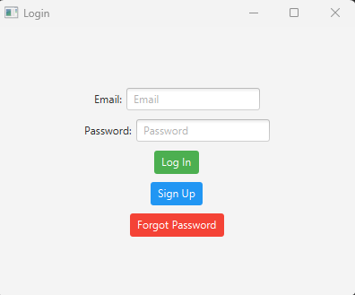
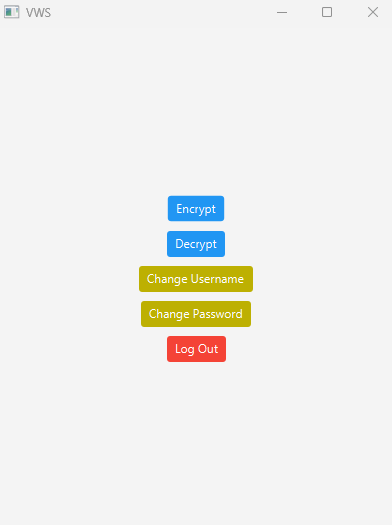
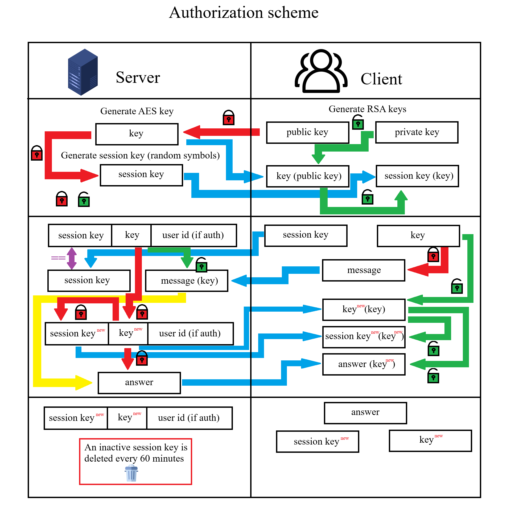

# Program VWS (video with secret) for hiding info and sending for anyone authorized user
  

# Table of contents
1. [Screenshots](#Screenshots)
2. [Tech Stack](#Stack)
3. [Features](#Features)
4. [Authorization scheme](#Scheme)
5. [Feedback](#Feedback)
6. [License](#License)

## Screenshots

### Login:

### Register:

### Menu:

## Tech Stack

- [**Client:** Java, JavaFX](client/README.md)
- [**Server:** Python, Flask](server/README.md)

## Features

- Additional protection of the communication session with the server
- Authorizing user
- Registration new user
- Changing password
- Changing username
- Password recovery
- Hiding info in video
- Protection against video interception by another user

## Authorization scheme

## Feedback

If you have any feedback, please reach out to us at vladimyr.kilko@gmail.com

## License

[GPLv3 License](LICENSE)

