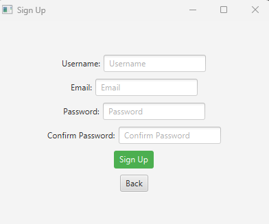
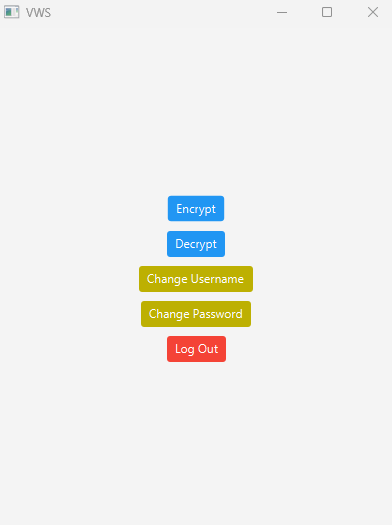

# Client VWS
  

# Table of contents
1. [Screenshots](#Screenshots)
2. [Tech Stack](#Stack)
3. [Features](#features)
4. [Run Locally](#run)
5. [Environment Variables](#environment)
6. [Feedback](#Feedback)
7. [License](#License)

## Screenshots

### Login:

### Register:

### Menu:

## Tech Stack

**Client:** Java, JavaFX

## Features

- Authorizing user
- Registration new user
- Changing password
- Changing username
- Password recovery
- Hiding info in video
- Protection against video interception by another user

## Run Locally

Clone the project

~~~bash
git clone https://github.com/ka9mal6t/secret_info_in_video.git
~~~

Go to the project directory

~~~bash
cd client/vws
~~~

Install dependencies 

~~~bash
mvn install
~~~

Start the client

~~~bash
mvn javafx:run
~~~

## Environment Variables

To run this project, you will need to edit the following environment variables to your Config.java file

`url`

## Feedback

If you have any feedback, please reach out to us at vladimyr.kilko@gmail.com

## License

[GPLv3](LICENSE)

